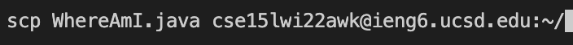

# Hi! Welcomed to the totorial for Remote Access and the Filesystem!

## Part 1: Install Visual Studio Code

>Visual Studio Code is a source-code editor with features including support for debugging, syntax highlighting, intelligent code completion, snippets, code refactoring, and embedded Git. And this is the tool I use to create this website!

*Go to the Visual Studio Code website https://code.visualstudio.com/, and follow the instructions to download and install it on your computer. If you need extra help, you can also watch this [Video Guideline.](https://www.youtube.com/watch?v=tCfbi5PF1y0)*

### If you install successfully and open it, you should see interface like this: 

----
## Part 2: Remotely Connecting

>SSH, also known as Secure Shell or Secure Socket Shell, is a network protocol that gives users, particularly system administrators, a secure way to access a computer over an unsecured network.

*To get basic understanding of ssh, you can watch this [video demonstration.](https://www.youtube.com/watch?v=z7jVOenqFYk)*

*To connect to the server, you should type*
**ssh + ip address of the romote server** *like this:*

_____

## Part 3: Trying Some Commands

>In computing, a command is a directive to a computer program to perform a specific task.

*There are some basic commands you should try out:*

* cd
* cd ..
* ls 
* pwd
* rm
* mkdir

*To learn more about commands and their applications, watch this [video.](https://www.youtube.com/watch?v=ogWoUU2DXBU)*

----

## Part 4: Moving Files with scp

>Secure copy protocol (SCP) is a means of securely transferring computer files between a local host and a remote host or between two remote hosts.

*To copy your local file to the romote server, you should type **scp + the file you want to copy + ip adress of the server** like this:*

----

## Part 5: Setting an SSH Key

>Ssh-keygen is a tool for creating new authentication key pairs for SSH. Such key pairs are used for automating logins, single sign-on, and for authenticating hosts.

*To generate the key, you should type* **ssh-keygen** *in the terminal, then you can see this shows up* 

*This created two new files on your system; the private key (in a file id_rsa) and the public key (in a file id_rsa.pub), stored in the .ssh directory on your computer.*

*Now we need to copy the public (not the private) key to the .ssh directory of your user account on the server. And here are the steps you should follow:*

1. login the server
2. type **mkdir .ssh** in the terminal
3. logout the server
4. type **scp /Users/kenry/.ssh/id_rsa.pub cs15lwi22awk@ieng6.ucsd.edu:~/.ssh/authorized_keys**, where you should use your username and the path you saw in the command above
5. then you can login in without entering password
----

## Part 6: Optimizing Remote Running

>Explore by yourself!

*There are lots of ways to make command line more efficient, what you should do is to keep learning and asking questions! There are some [advanced command lines video](https://www.youtube.com/watch?v=Ym2pxzWpTNw) to watch!* 
