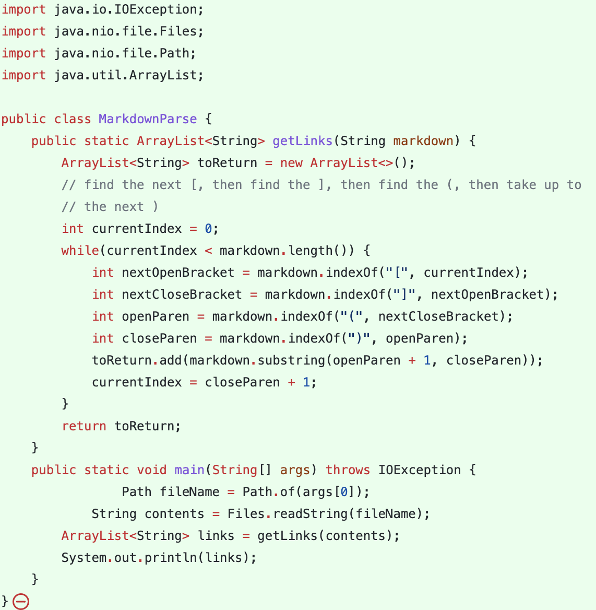
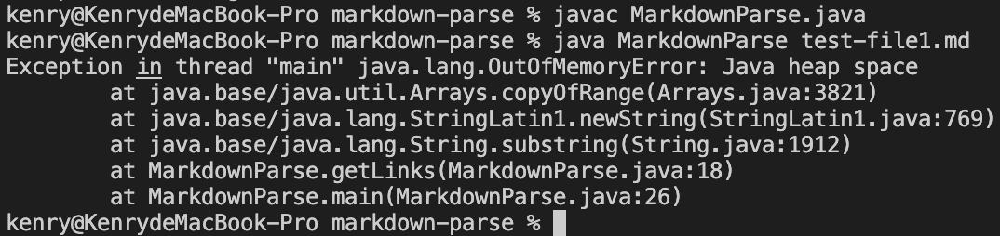
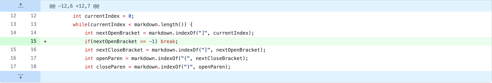
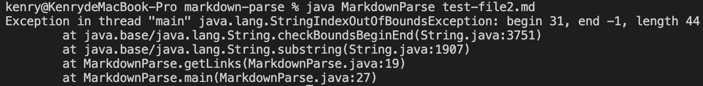
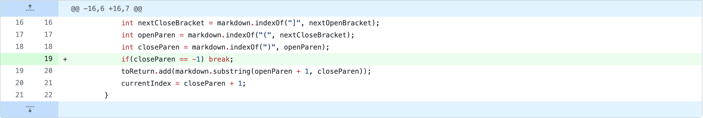
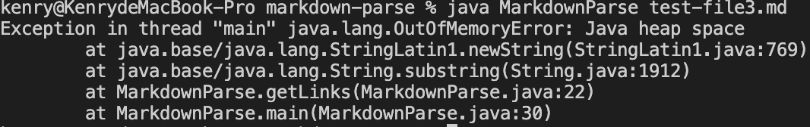
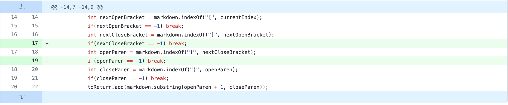

# Hi! Welcomed to the Week 4 Lab Report

# *This is the orignal code:*

## Part 1: First Code Change

*This is the [test-file1.md](https://github.com/Kenry3/markdown-parse/blob/main/test-file1.md) that has been changed by adding one empty line, which leads to an infinite loop:*

*The code we use to fix this problem:*

*We realize if there are more lines or words after the end of the last link, the while loop won't stop. That's bacause the `nextOpenBracket`  will return -1, and the next line `markdown.indexOf("]", -1)`  will go through the whole String again to find the first `]`  symbol, and the whole process will repeat over and over again. Adding if statement to check if `nextOpenBracket == -1`  can solve this problem by breaking the loop*

---

## Part 2: Second Code Change

*This is the [test-file2.md](https://github.com/Kenry3/markdown-parse/blob/main/test-file2.md) changed by deleting the last parenthesis, which induces this error message:*

*The code to fix this problem:*

*Since the last close parenthesis is missing, variable `closeParen`  evaluate to -1, and the next line of code `toReturn.add(markdown.substring(openParen + 1, -1))`  will throw error message since the start position is greater than the end position. Adding if statement to check if `closeParen == -1`  can solve this problem by breaking the loop*

---

## Part 3: Third Code Change

*This is the [test-file3.md](https://github.com/Kenry3/markdown-parse/blob/main/test-file3.md) changed by deleting one of `]` , which will lead to an infinite loop:*

*The code to fix this problem:*

*We realize missing parenthesis or bracket in the last link will induce infinite loop, so we just add more if conditions to make sure that the program will stop whenever there is no more links found*

