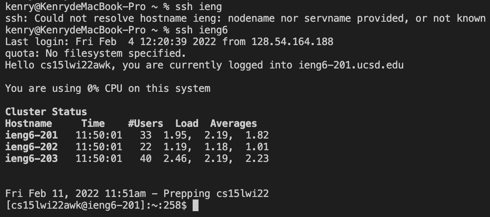

# Streamlining ssh Configuration

### It's annoying to type `ssh cs15lwi22awk@ieng6.ucsd.edu`  every time to login to the remote server. 

>SSH, like many programs, has configuration files that can save you some typing. 

*We can make changes to config file in path ~/.ssh/config that tells SSH what username to use when logging into specific servers, and even give servers nicknames.*

*We can edit config file in visual studio code*

*and change it to*

*Now we can login to our remote server faster and easier!* 

*let's also try if `scp`  works expectedly*

*Perfect!*

