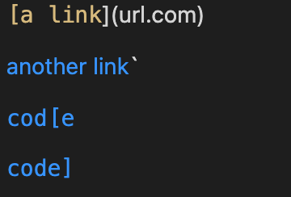
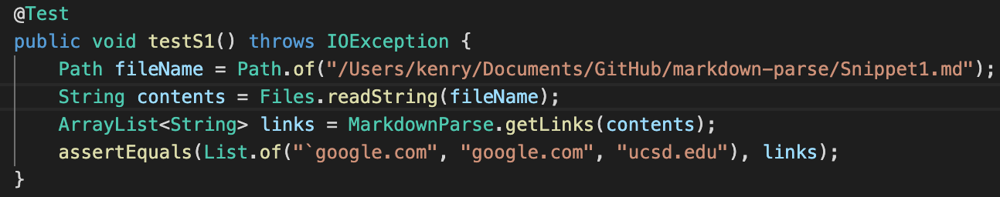
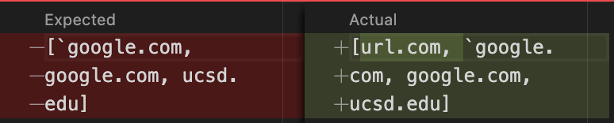
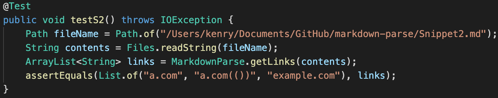
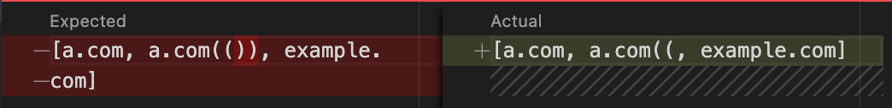
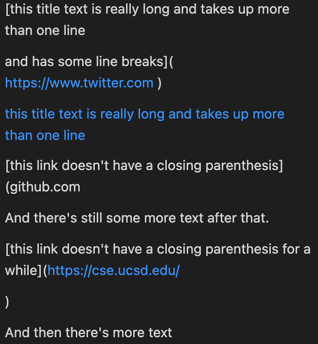
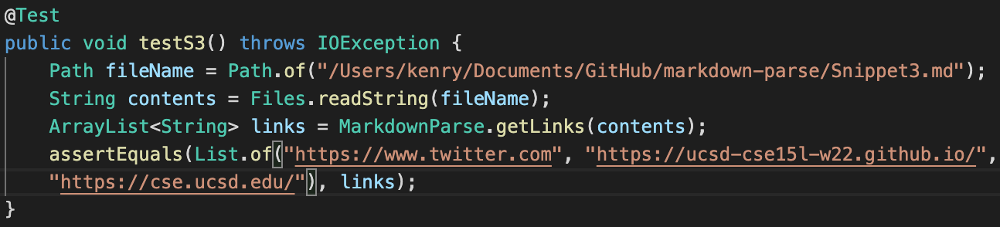

# Week 8 Lab Report #

>Click the [link](https://github.com/Kenry3/markdown-parse) to my markdown-parse repository

>Click the [link](https://github.com/clingunis/markdown-parse) to reviewed markdown-parse repository

## Snippet 1 ##

**the preview of Snippet 1**

*So the expected output of our markdownParse program should be ``[`google.com, google.com, ucsd.edu]`` . So I create a test:*

*The test failed for both programs since our code didn't check for backticks. Thus, the list includes element that's not supposed to be there*

**The possible code change:**
1. create variables `bS` and `bE` representing the start of backticks and the end of backticks
2. add `if` statement to check if the index of `bS` is smaller than the index of `nextOpenBracket`
3. if it is smaller and the index of `bE != -1`, then search the `nextOpenBracket` after the index of `bE`

## Snippet 2 ##

**the preview of Snippet 1**

*So the expected output of our markdownParse program should be `[a.com, a.com(()), example.com]` . So I create a test:*

*The test failed for both programs since our code just simply check if the link is in the format `` *

**The possible code change:**

1. find the closest `nextOpenBracket` to the `nextCloseBracket`
2. check if it is locating after `\`

## Snippet 3 ##

**the preview of Snippet 1**

*So the expected output of our markdownParse program should be `[https://www.twitter.com, https://ucsd-cse15l-w22.github.io/, https://cse.ucsd.edu/]` . So I create a test:*

*The test failed for both programs since our code didn't take the empty new line and link starts with `http or https`  into consideration

**The possible code change:**

1. if there are empty new line, use `continue`  and set current index to the start index of non empty new line

2. Before adding links to list, use method `trim()`  on element

3. check if string starts with `http or https` 

