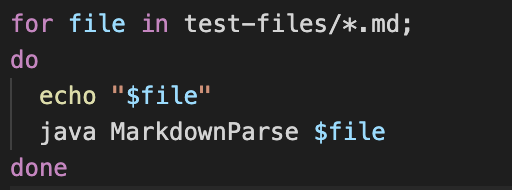
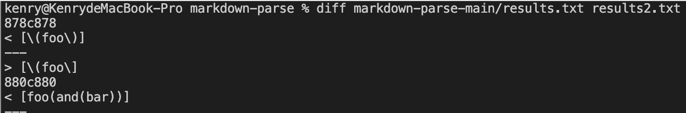
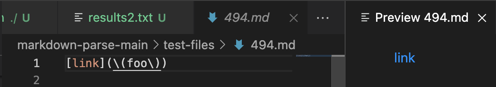
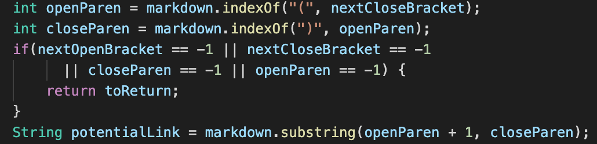

# Week 10 Lab Report #

*By using bash for loop and `>` command, I save the output of running each file by provided MarkdownParse and my own MarkdownParse into `results.txt` and `results2.txt`, then I use `diff` to compare the outputs, and here is the display on the terminal:*

*The test file that causes two different output:*

*According to the preview, `link` is regarded as a link with `\(foo\)` as its URL.*

*Therefore, the implementation from provided MarkdownParse seems to be correct since it correctly prints out `\(foo\)`*

*The problem with my code is that it just simply checks location of first `)` and includes the content within `()`*

